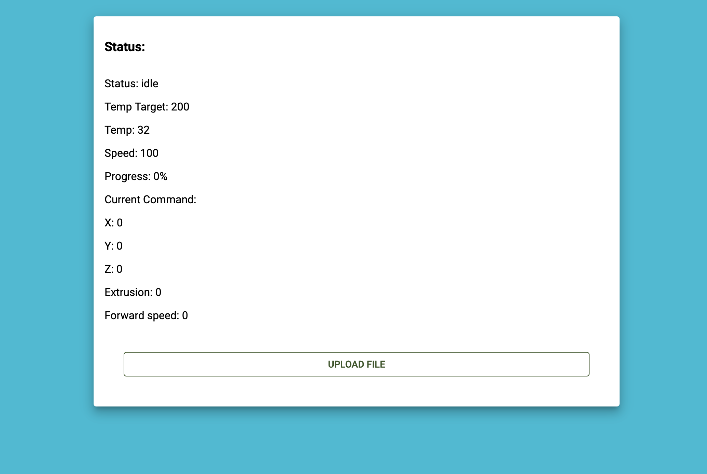
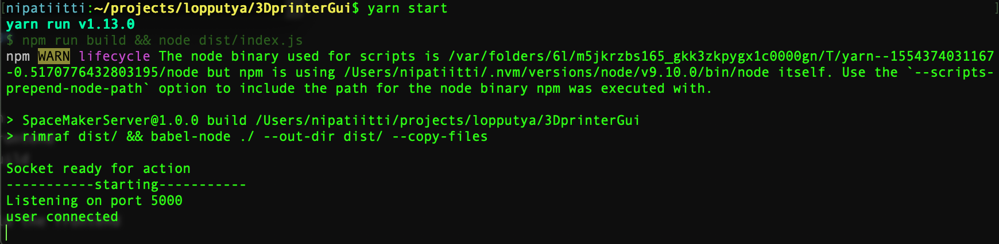

# MakerSpaceServer

This is a pure javascript project that has frontend and backend. The frontend is made with [React](https://reactjs.org/) and it follows the best and newest web practices.

The backend uses [express.js](https://expressjs.com/) and [socket.io](https://socket.io/) to achieve fast and reliable realtime communicaton with the frontend. It also has [mongodb](https://www.mongodb.com/) for dynamic JSON datastorage to NoSQL database. The GPIO-ports are driven with [rpi-gpio](https://github.com/JamesBarwell/rpi-gpio.js).

Entrypoint fro backend is [index.js](./index.js) and for frontend it's [frontend/src/index.js](./frontend/src/index.js)

Frontend in idle mode


Backend after user successfully connects


## Installation

You need to install [node](https://nodejs.org/en/) and [yarn](https://yarnpkg.com/lang/en/)

run

```bash
yarn install
cd ./frontend
yarn install
```

to install all the depencies

## Usage

run

```bash
cd ./frontend
yarn build
```

to build the frontend
then
run

```bash
yarn start
```

to build and run the backend. The frontend is automaticly server in the root of the server (http://localhost:5000)
and the api is in the (http://localhost:5000/api)

You can also run the frontend independently in the dev mode (use this if you don't have board that supports the RPI-GPIO library)

```bash
cd ./frontend
yarn start
```

## Contributing

Pull requests are welcome. For major changes, please open an issue first to discuss what you would like to change.

Please make sure to update tests as appropriate.

## License

[MIT](https://choosealicense.com/licenses/mit/)
